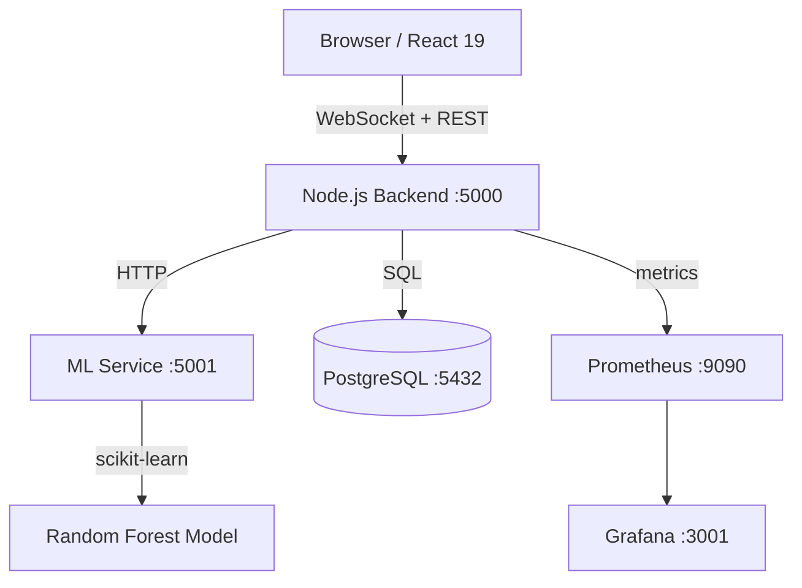

# ◈ ChronoLog

> Real-time log intelligence with causal chain detection

[](https://github.com/Akchhya1108/smart-debug-console/actions/workflows/ci.yml)
[](LICENSE)
[](https://nodejs.org/)
[](https://python.org/)

**ChronoLog** is a production-grade log monitoring system that goes beyond classification.
It automatically detects *causal relationships* between log events — showing you not just
what broke, but what *caused* it to break and how far the damage spread.

---

## What Makes It Different

Every log tool classifies logs. ChronoLog understands them.

| Feature | Datadog / Splunk | ChronoLog |
|---------|-----------------|-----------|
| Log classification | ✅ | ✅ |
| Real-time streaming | ✅ | ✅ |
| Causal chain detection | ❌ | ✅ |
| Blast radius scoring | ❌ | ✅ |
| Temporal anomaly fingerprinting | ❌ | ✅ |
| Root cause surfacing | Manual | ✅ Automatic |

---

## Causal Intelligence

When your database goes down, ChronoLog shows you:

```
[CRITICAL] db: connection pool exhausted          ← ROOT CAUSE (blast radius: 14.2)
  └─[ERROR]  api: failed to fetch user data        ← depth 1
      └─[ERROR]  auth: session validation failed   ← depth 2
          └─[WARNING] api: returning 503           ← depth 3

Fix the root node. The downstream symptoms resolve automatically.
```

The causal engine works by correlating log timestamps, source services, and error signatures
within a sliding 30-second window. When a chain is detected, a `causal:chain-detected`
WebSocket event fires within 500ms and the D3 graph updates live.

---

## Architecture



| Layer | Technology |
|-------|-----------|
| Frontend | React 19, Tailwind CSS, D3.js, Socket.io-client |
| Backend | Node.js 18, Express, Socket.io, Winston |
| ML Service | Python 3.10, Flask, scikit-learn |
| Database | PostgreSQL 15 |
| Monitoring | Prometheus, Grafana |
| Infrastructure | Docker, nginx |

---

## ML Model

- **Algorithm**: Random Forest with TF-IDF (n-grams 1–3)
- **Training data**: 5,000 synthetic + 200 real-world log patterns per class
- **Synthetic test accuracy**: 100% (expected — same distribution)
- **Out-of-distribution accuracy**: ~78% on 200 hand-labeled real log lines
- **Inference latency**: <1ms P99

The model performs best on structured service logs. Free-form application logs
may require fine-tuning on your specific log vocabulary.

---

## Quick Start

```bash
git clone https://github.com/Akchhya1108/smart-debug-console.git
cd smart-debug-console
cp .env.example .env
docker compose up -d
```

Open [http://localhost:3000](http://localhost:3000)

| Service | URL | Credentials |
|---------|-----|-------------|
| App | http://localhost:3000 | — |
| Backend API | http://localhost:5000 | — |
| ML Service | http://localhost:5001 | — |
| Grafana | http://localhost:3001 | admin / admin |
| Prometheus | http://localhost:9090 | — |

> **First run**: the `ml-service` container trains the model during build (`~30s`).
> Subsequent starts use the cached image and are instant.

---

## Development (without Docker)

### Backend

```bash
cd backend
npm install
npm run dev          # nodemon, port 5000
```

### ML Service

```bash
cd ml-service
python -m venv venv
# Windows:
venv\Scripts\activate
# macOS/Linux:
source venv/bin/activate

pip install -r requirements.txt
python src/train_model.py   # one-time
python src/app.py           # port 5001
```

### Frontend

```bash
cd frontend
npm install
npm start            # CRA dev server, port 3000
```

Set `REACT_APP_API_URL=http://localhost:5000` and `REACT_APP_WS_URL=http://localhost:5000`
in `frontend/.env`.

---

## API Reference

All endpoints return `{ status, data, meta }`.

### Backend (`:5000`)

| Method | Path | Description |
|--------|------|-------------|
| `GET` | `/health` | Health check |
| `GET` | `/api/logs` | Paginated log list (`?limit=50&offset=0&severity=error`) |
| `POST` | `/api/logs` | Ingest a log entry |
| `GET` | `/api/logs/stats` | Severity counts + throughput |
| `GET` | `/api/anomalies` | Detected anomalies |
| `GET` | `/api/metrics` | Prometheus metrics |

### ML Service (`:5001`)

| Method | Path | Description |
|--------|------|-------------|
| `GET` | `/health` | Health + model metadata |
| `POST` | `/api/classify` | Classify a single log message |
| `POST` | `/api/classify/batch` | Classify up to 100 messages |

### WebSocket Events

| Event | Direction | Description |
|-------|-----------|-------------|
| `log:new` | server → client | New log entry ingested |
| `log:stats` | server → client | Updated severity counts |
| `causal:chain-detected` | server → client | New causal chain identified |
| `anomaly:detected` | server → client | Temporal anomaly fingerprint |

---

## Environment Variables

Copy `.env.example` to `.env` and change values for production.

| Variable | Default | Description |
|----------|---------|-------------|
| `POSTGRES_PASSWORD` | `debug_secret` | PostgreSQL password |
| `ADMIN_API_KEY` | `dev_key_change_in_prod` | Admin endpoint key |
| `GRAFANA_PASSWORD` | `admin` | Grafana admin password |

---

## Screenshots

<div align="center">


**Main Dashboard — real-time log stream with causal chain overlay**

<br/>


**ML Analytics — confidence scores and severity distribution**

<br/>


**Grafana — throughput, WebSocket connections, ML latency**

</div>

---

## License

MIT — free for personal and commercial use.

---

## Author

**Akchhya Singh** — [GitHub](https://github.com/Akchhya1108) · [LinkedIn](https://linkedin.com/in/akchhya-singh11) · akchhya.dev@gmail.com
