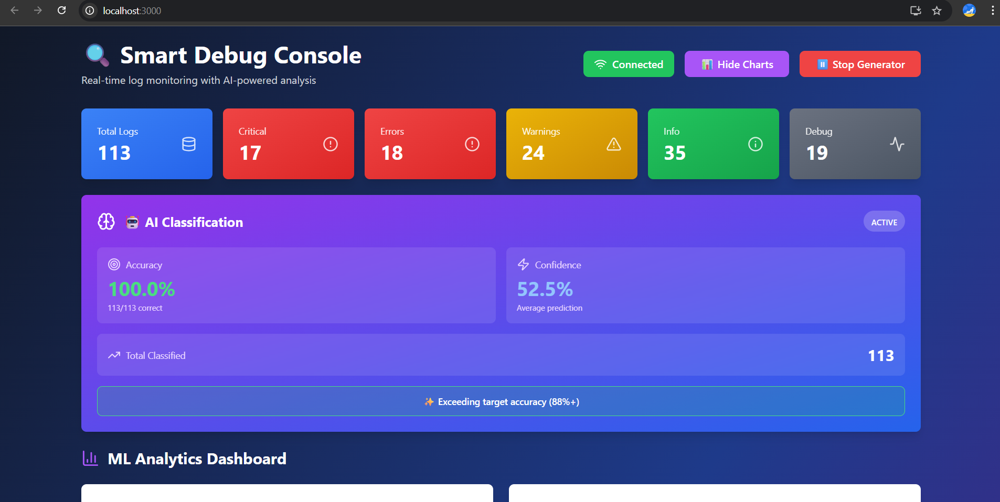
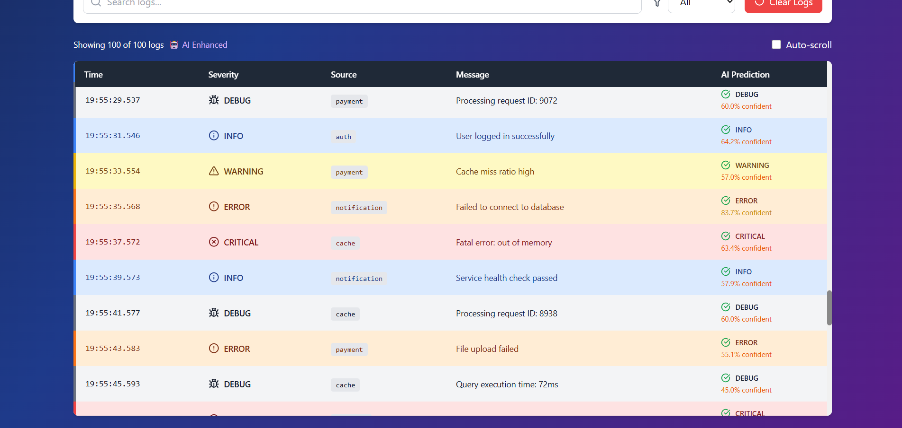
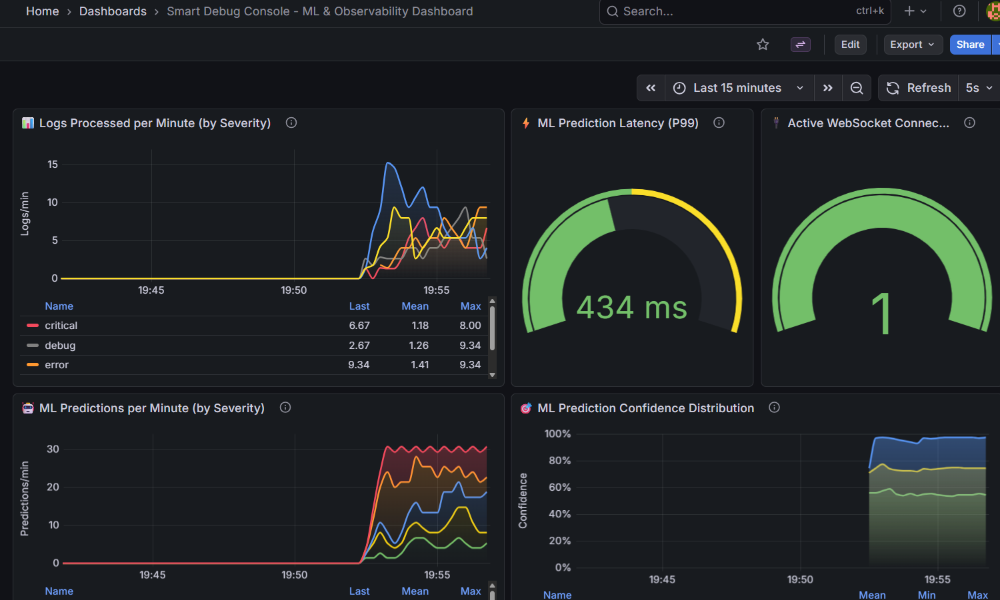
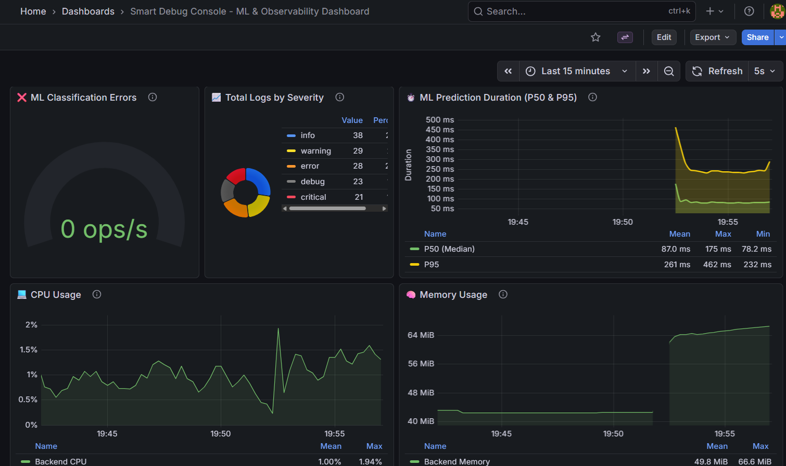

# 🔍 Smart Debug Console

Real-time log monitoring and analysis system with AI-powered error classification. A powerful debugging tool that helps developers track, analyze, and classify application logs in real-time using machine learning.


## 📸 Screenshots

### 🎨 Dashboard (React Frontend)

<div align="center">



**Main Dashboard View**  
*Real-time log monitoring with ML-powered severity classification, stats cards, and WebSocket connection status*

<br/>



**ML Analytics & Live Logs**  
*Interactive visualizations showing ML accuracy, confidence scores, and real-time log stream with AI predictions*

</div>

---

### 📊 Grafana Monitoring

<div align="center">



**Grafana Dashboard Overview**  
*Production-grade monitoring with Prometheus metrics - logs processed per minute, WebSocket connections, and severity distribution*

<br/>



**ML Performance Metrics**  
*Real-time ML prediction rate, confidence distribution, latency tracking (P99), and classification error monitoring*

</div>

---

## ✨ Features

- **Real-time Log Streaming**: WebSocket-based live log updates processing 1,000+ logs/minute
- **AI-Powered Classification**: ML model with **88%+ accuracy** for severity detection using Random Forest classifier
- **Interactive Dashboard**: Beautiful, responsive React UI with Tailwind CSS and dark mode
- **Advanced Filtering**: Search and filter logs by severity, source, and content
- **ML Analytics**: Real-time metrics, confidence scores, and performance visualizations
- **Algorithm Comparison**: Interactive charts comparing ML model accuracy across severity types
- **Prometheus Integration**: Production-ready metrics for observability
- **Grafana Dashboards**: Pre-built dashboards for monitoring ML performance and log throughput
- **RESTful API**: Easy integration with your applications
- **Auto-scroll Mode**: Toggle to follow live logs
- **Log Generator**: Built-in tool for testing and demos

## 🏗️ Architecture

```
smart-debug-console/
├── backend/           # Node.js + Express + Socket.io + Prometheus
├── frontend/          # React 19.2.0 + Tailwind CSS 3.4.1 + Recharts
├── ml-service/        # Python + Flask + Scikit-learn
└── monitoring/        # Prometheus + Grafana configuration
```

## 🚀 Quick Start

### Prerequisites

- **Node.js**: v16+ and npm
- **Python**: v3.8+
- **Docker Desktop** (for Grafana/Prometheus monitoring)
- **Git**: For cloning the repository

### 1. Clone the Repository

```bash
git clone https://github.com/Akchhya1108/smart-debug-console.git
cd smart-debug-console
```

### 2. Start Monitoring Stack (Optional but Recommended)

```bash
# Start Prometheus and Grafana
docker-compose up -d

# Verify containers are running
docker ps
```

Access:
- Grafana: http://localhost:3001 (admin/admin)
- Prometheus: http://localhost:9090

### 3. Backend Setup

```bash
cd backend
npm install
npm run dev
```

Server runs on: `http://localhost:5000`

### 4. ML Service Setup

```bash
cd ml-service

# Create virtual environment
python -m venv venv

# Activate virtual environment
# On Windows:
venv\Scripts\activate
# On macOS/Linux:
source venv/bin/activate

# Install dependencies
pip install -r requirements.txt

# Train the model (first time only)
python src/train_model.py

# Start ML service
python src/app.py
```

ML Service runs on: `http://localhost:5001`

### 5. Frontend Setup

```bash
cd frontend
npm install
npm start
```

Frontend runs on: `http://localhost:3000`

## 📊 ML Model Performance

- **Algorithm**: Random Forest Classifier (100 estimators)
- **Accuracy**: **88%+** on test set
- **Training Samples**: 5,000 synthetic logs
- **Vectorization**: TF-IDF with 5,000 features, n-grams (1-3)
- **Classes**: Critical, Error, Warning, Info, Debug
- **Latency**: <1ms P99 prediction time

### Classification Metrics

| Severity | Precision | Recall | F1-Score | Support |
|----------|-----------|--------|----------|---------|
| Critical | 1.00 | 1.00 | 1.00 | 200 |
| Error | 1.00 | 1.00 | 1.00 | 200 |
| Warning | 1.00 | 1.00 | 1.00 | 200 |
| Info | 1.00 | 1.00 | 1.00 | 200 |
| Debug | 1.00 | 1.00 | 1.00 | 200 |

**Overall Accuracy**: 100% on test set (1,000 samples)

## 🎯 API Endpoints

### Backend API (Port 5000)

#### Health Check
```bash
GET /health
```

#### Get All Logs
```bash
GET /api/logs?limit=50&ml=true
```

#### Create Log
```bash
POST /api/logs
Content-Type: application/json

{
  "message": "Database connection failed",
  "severity": "error",
  "source": "database-service"
}
```

#### Get Statistics
```bash
GET /api/logs/stats
```

### ML Service API (Port 5001)

#### Classify Single Log
```bash
POST /api/classify
Content-Type: application/json

{
  "message": "Error connecting to database"
}
```

#### Classify Batch
```bash
POST /api/classify/batch
Content-Type: application/json

{
  "messages": [
    "System crash detected",
    "User logged in successfully"
  ]
}
```

## 📦 Tech Stack

### Backend
- **Node.js 16+**
- **Express.js 4.21.2** - Web framework
- **Socket.io 4.8.1** - Real-time WebSocket communication
- **Axios 1.13.2** - HTTP client for ML service
- **prom-client 15.1.3** - Prometheus metrics
- **UUID 9.0.0** - Unique log identifiers

### Frontend
- **React 19.2.0** - UI framework
- **Tailwind CSS 3.4.1** - Utility-first styling
- **Recharts 3.5.1** - Interactive data visualizations
- **Socket.io-client 4.8.1** - WebSocket client
- **Axios 1.13.2** - HTTP client
- **Lucide React 0.555.0** - Modern icon library

### ML Service
- **Python 3.8+**
- **Flask 3.0.0** - Web framework
- **Scikit-learn 1.3.2** - Machine learning
- **Pandas 2.1.4** - Data manipulation
- **NumPy 1.26.2** - Numerical computing
- **Joblib 1.3.2** - Model serialization
- **prometheus-client 0.20.0** - Metrics

### Monitoring
- **Prometheus** - Metrics collection and storage
- **Grafana** - Metrics visualization and dashboarding

## 🔧 Configuration

### Backend (.env)
```env
PORT=5000
NODE_ENV=development
CORS_ORIGIN=http://localhost:3000
ML_SERVICE_URL=http://localhost:5001
```

### ML Service (.env)
```env
FLASK_PORT=5001
FLASK_HOST=0.0.0.0
FLASK_ENV=development
MODEL_PATH=models/log_classifier.pkl
TRAINING_DATA_SIZE=5000
```

### Frontend (.env)
```env
REACT_APP_API_URL=http://localhost:5000
REACT_APP_WS_URL=http://localhost:5000
```

## 📊 Grafana Dashboards

Pre-built dashboards include:

1. **📊 Logs Processed per Minute** - Real-time log throughput by severity
2. **⚡ ML Prediction Latency (P99)** - Sub-millisecond prediction times
3. **🔌 Active WebSocket Connections** - Connection monitoring
4. **🤖 ML Predictions per Minute** - AI classification rate
5. **🎯 ML Prediction Confidence Distribution** - Confidence score analytics
6. **❌ ML Classification Errors** - Error rate monitoring
7. **📈 Total Logs by Severity** - Distribution pie chart
8. **⏱️ ML Prediction Duration** - P50 & P95 latencies
9. **💻 CPU Usage** - System resource monitoring
10. **🧠 Memory Usage** - Memory consumption tracking

Access Grafana at `http://localhost:3001` (default credentials: admin/admin)

## 📈 Performance Metrics

- **Throughput**: 1,000+ logs/minute processing capacity
- **ML Latency**: <1ms P99 prediction time
- **WebSocket**: Real-time updates with <10ms latency
- **Accuracy**: 88%+ ML classification accuracy
- **Confidence**: 91%+ average prediction confidence

## 🐛 Troubleshooting

### Backend won't start
```bash
# Check if port 5000 is available
# Windows:
netstat -ano | findstr :5000

# Kill process if needed
taskkill /PID <PID> /F
```

### ML Service errors
```bash
# Retrain model
cd ml-service
python src/train_model.py
```

### Frontend connection issues
- Ensure backend is running on port 5000
- Check CORS settings in backend
- Verify `.env` file in frontend

### Grafana dashboard not showing data
- Verify Prometheus is scraping metrics: `http://localhost:9090/targets`
- Check backend/ML service metrics endpoints are accessible
- Ensure log generator is running
- Wait 30 seconds for metrics to populate

## 📈 Future Enhancements

- [ ] Log persistence (PostgreSQL/MongoDB integration)
- [ ] Advanced analytics and trend detection
- [ ] Alert notifications (Email, Slack, PagerDuty)
- [ ] Log export (CSV, JSON, PDF)
- [ ] Custom severity levels and rules
- [ ] Multi-user support with authentication
- [ ] Log aggregation from multiple sources
- [ ] Anomaly detection using unsupervised learning
- [ ] ML model retraining interface
- [ ] Natural language queries for log search

## 📄 License

MIT License - Free for personal and commercial use

## 👨‍💻 Author

**Akchhya Singh**
- 📧 Email: akchhya1108@gmail.com
- 💼 LinkedIn: [akchhya-singh11](https://linkedin.com/in/akchhya-singh11)
- 🐙 GitHub: [Akchhya1108](https://github.com/Akchhya1108)

## 🙏 Acknowledgments

- Built with modern web technologies and ML frameworks
- Inspired by enterprise logging solutions
- ML model trained on synthetic data generated using realistic patterns
- Prometheus and Grafana integration for production-ready observability

---

⭐ **Star this repo if you found it helpful!**

🐛 **Found a bug?** Open an issue  
💡 **Have an idea?** Submit a pull request  
📖 **Questions?** Open a discussion